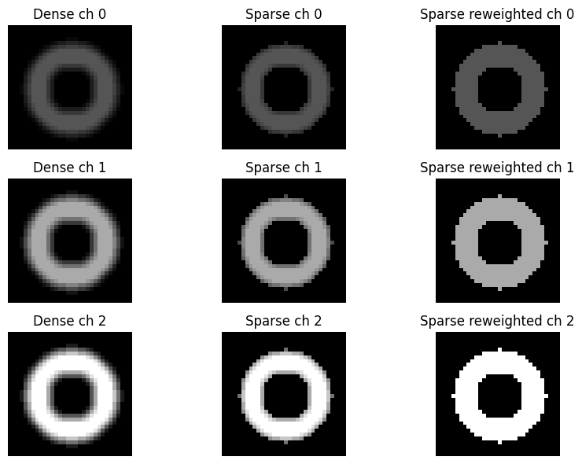

# Sparse ConvNeXt Encoder and Reweighted Sparse Convolution

## Sparse ConvNeXt encoder

The MAE encoder is a ConvNeXtV2-tiny modified to use **sparse convolutions** during pre-training. This follows the [SparK](https://github.com/keyu-tian/SparK) approach: masked patches are zeroed out and the active (unmasked) region is tracked via a binary mask. Convolutions are applied only over active locations, so masked regions do not contribute to feature statistics.

## Reweighted sparse convolution (custom modification)

Standard sparse convolution computes a weighted sum over a convolution window, but when the window overlaps the mask boundary, some kernel positions land on zeroed-out (inactive) pixels. This dilutes the output compared to a convolution that only sees active pixels — the effective normalization of the kernel is smaller near boundaries.

We introduce `SparseConv2dReweighted` (`src/nets/sparse_transform.py`) to correct for this. This is **not part of the original SparK implementation** and was added to prevent masked (zero-padded) regions from biasing the convolution output at active-region borders. The correction works as follows:

1. **Apply the convolution** on the masked input (inactive pixels are zero).
2. **Compute how much of each kernel was actually active** for every output position, by convolving the binary input mask with the absolute kernel weights. This gives the effective kernel mass `mask_sum` at each position.
3. **Rescale the output** so that the contribution is normalized relative to the full kernel mass `full_sum`:

   ```
   output_normalized = output_no_bias / (mask_sum + ε) × full_sum
   ```

4. **Zero out inactive output positions** using the output mask, so sparse regions remain inactive in the next layer.

The effect is that a border convolution window with only half its support over active pixels will have its output scaled up to match what a fully-active window would have produced — preventing the artificial suppression of activations at the active-region boundary caused by zero-padded masked pixels.

## Illustration

The image below demonstrates the effect on a white circle (the "active region") against a black background, across three intensity levels (rows: 0.33, 0.66, 1.0) and three convolution implementations (columns):

| Dense conv | SparK sparse conv | Reweighted sparse conv |
|:---:|:---:|:---:|
| Edges distorted in both directions: white pixels bleed inward, black pixels bleed outward due to kernel averaging across the boundary | No bleeding into black pixels, but white-region edges are blurry — active-boundary activations are suppressed by partial kernel coverage | Clean edges at all intensities — boundary activations are rescaled to match fully-active kernel output |


